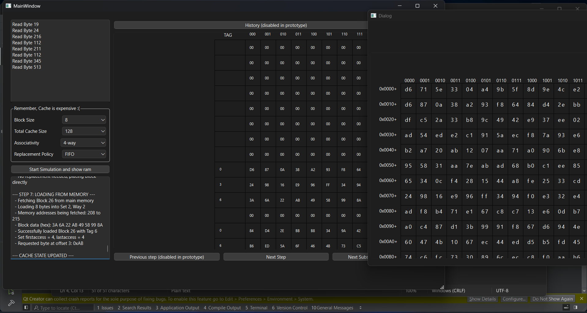

# CPU Cache Teaching Tool

Welcome! This is a small, hands‑on app that helps you *see* how a CPU
cache behaves.\
Instead of reading dry theory, you get buttons, 
and clear explanations of what's going on behind the scenes.

If you've ever wondered why a cache hit feels fast or what "4‑way
associative" even means, this tool lets you play with it WITH YOUR OWN CODE until it
clicks.

------------------------------------------------------------------------

## What This App Does

-   Lets you tweak cache size, block size, and associativity\
-   Shows hits, misses, and how blocks move around\
-   Walks through each memory instruction step‑by‑step\
-   Visually draws the cache so you always know what's happening\
-   Simple enough for beginners, helpful enough for teaching

------------------------------------------------------------------------

## Why It Exists

Caches can feel mysterious.\
This tool tries to make them *visible* --- so you can learn by playing
instead of guessing or memmorizing.

------------------------------------------------------------------------

## Features at a Glance

###  Easy Controls

Pick your: - Cache size\
- Block size\
- Associativity (Direct, 2‑way, 4‑way, Fully associative)\
- Replacement strategy (FIFO or LRU)

###  Visual Cache View

The cache is drawn as a friendly grid.\
When things change, the drawing updates in real time.

###  Step‑By‑Step Simulation

Enter lines like:

    Read Byte 32
    Read Byte 200

Then watch: 1. How the address is broken down\
2. Whether you get a hit or miss\
3. What block gets pulled into the cache\
4. Which line gets replaced\
5. The byte you ultimately read

Everything is explained in simple language.

------------------------------------------------------------------------

## How to Run It

### Requirements

-   Qt 5 or 6\
-   A C++17 compiler

### Build

    mkdir build
    cd build
    cmake ..
    make
    ./CpuCacheTeachingTool

Or just open it in Qt Creator and click Run.

------------------------------------------------------------------------

## Behind the Scenes (Short Version)

-   The program uses a small "fake memory" array as the backing store\
-   Each cache line stores:
    -   A tag\
    -   Block data\
    -   Access info (for LRU / FIFO)\
-   When you run an instruction, the app:
    1.  Figures out which block and set it belongs to\
    2.  Checks the set for a matching tag\
    3.  Reports a hit or miss\
    4.  Replaces a line if needed\
    5.  Loads the block and reads the final byte\
-   The UI logs everything so nothing feels magical

------------------------------------------------------------------------

## Perfect For...

-   Students learning caches\
-   Teachers explaining memory hierarchy\
-   Anyone who wants to understand why CPU caches matter\
-   People who learn best by *messing around and seeing what happens*

------------------------------------------------------------------------

Thanks for checking out the CPU Cache Teaching Tool!\
Hope it makes caching feel a lot less mysterious 🙂

### Example
Changes confirmation

